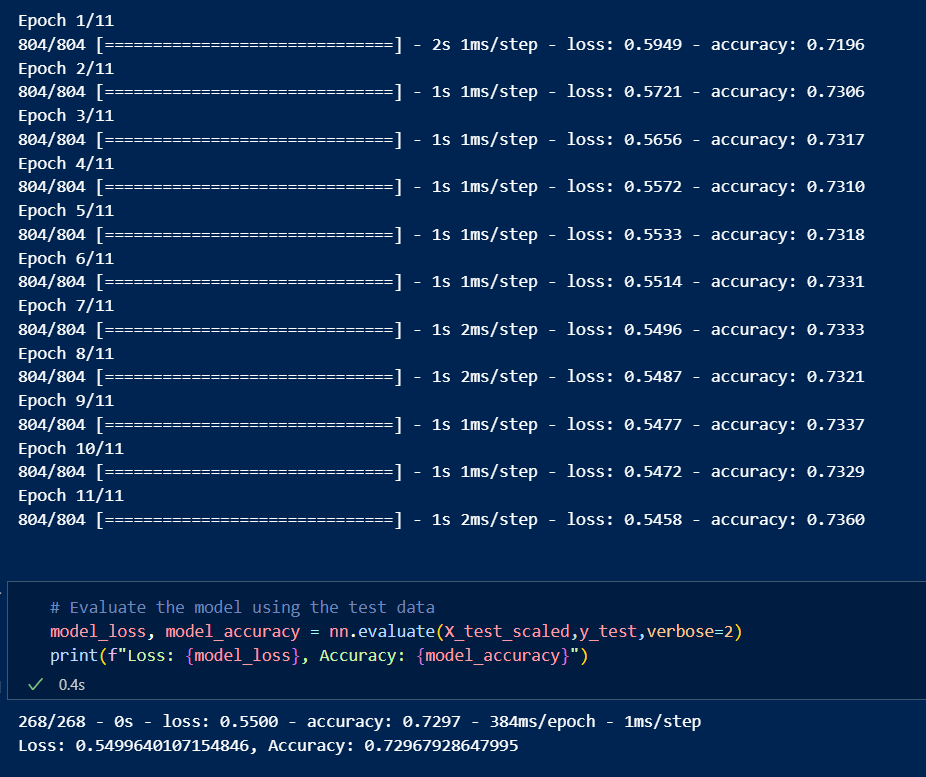

# deep-learning-challenge

The repository contains starter code to compare outputs with, the Jupyter Notebook with the original model, the Jupyter Notebook with the attempts to optimize it, the H5 exported files, and a Results folder for the images that are necessary to display in the report.

# Report
**Step 4: Write a Report on the Neural Network Model**
For this part of the assignment, you’ll write a report on the performance of the deep learning model you created for Alphabet Soup.

The report should contain the following:

**Overview of the analysis: Explain the purpose of this analysis.**
* The purpose of the assignment was to create a model for Alphabet Soup Charity that could predict accurately whether a project would be successful if it receives funding.

**Results: Using bulleted lists and images to support your answers, address the following questions:**

Data Preprocessing
* What variable(s) are the target(s) for your model?
    * The target variable which the model is supposed to predict was the 'IS_SUCCESSFUL' boolean.
* What variable(s) are the features for your model?
    * 'APPLICATION_TYPE'
    * 'AFFILIATION'
    * 'CLASSIFICATION'
    * 'USE_CASE'
    * 'ORGANIZATION'
    * 'STATUS'
    * 'INCOME_AMT'
    * 'SPECIAL_CONSIDERATIONS'
    * 'ASK_AMT'
* What variable(s) should be removed from the input data because they are neither targets nor features?
    * 'EIN' and 'NAME' are unique identifiers and not categorical data, meaning they are neither targets nor features and should be removed from the input data, which we did in step 1.

Compiling, Training, and Evaluating the Model
* How many neurons, layers, and activation functions did you select for your neural network model, and why?
    * Initially, there were two hidden layers, though my first attempt to optimize added a third layer. The first layer had 80 neurons, the second had 22, and the third had 11. Upon multiple attempts to optimize the performance of the model, I experimented with a fourth hidden layer (sank the model's performance), found that roughly the amount of neurons per layer that I had was ideal, and found that the 'tanh' and 'relu' activation functions were the most practical to achieving a high performance. Usage of 'sigmoid' sank the model's performance.
* Were you able to achieve the target model performance?
    * No, though I did get it closer than the original model. My original model had 69% accuracy, while the optimized model was pushing 73% accuracy. I never achieved 75+%.
* What steps did you take in your attempts to increase model performance?
    * First attempt to optimize: I added a third hidden layer.
        * Accuracy: 69% -> 72% (+)
    * Second attempt to optimize: I experimented with different activation functions and neuron quantities.
        * Accuracy: 72% -> 73% (+)
    * Third attempt to optimize: I decreased epochs from 100 to 11 (the internet said 11 is ideal for many models), I added (and removed) a fourth hidden layer, I removed (and readded) 'SPECIAL_CONSIDERATIONS,' as I thought it might be an unimportant variable that hurt the model more than it helped.
        * Accuracy: 73% -> 72% (-)
    * Fourth attempt to optimize: I decreased and increased the number of values in the 'other' bins, and settled on a number for each bin, though it barely affected performance.
        * Accuracy: 72% -> 73% (+)

    * Was 75% breached?
        * No. Although I moved the model's accuracy from 69% to 73%, it never hit the target.

Summary: Summarize the overall results of the deep learning model. Include a recommendation for how a different model could solve this classification problem, and then explain your recommendation.
* In the end, the model was roughly 73% accurate, meaning that 73% of the time it would accurately be able to predict whether or not a funded project would fail or succeed. With additional data cleanup, different activation functions and more iterations, it is possible that the accuracy could be raised above 75%. 
* There are a number of alternate models to the deep-learning model. A popular alternative is the Random Forest model, which merges decision trees instead of having multiple hidden layers. That model may be able to help achieve a higher performance and could be a better fit for the data.

IMAGES
